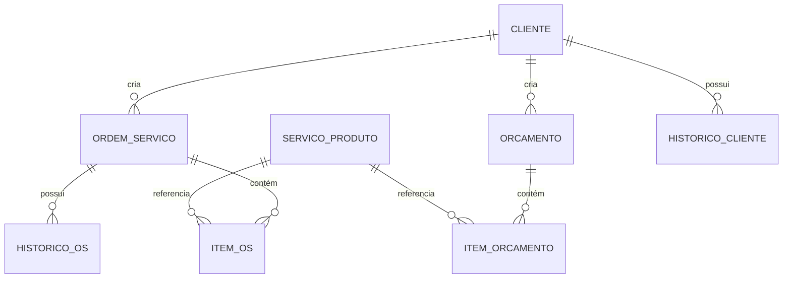

# 06 - Modelo do Banco de Dados

**Projeto:** OS Mobile - Sistema de Gestão de Ordens de Serviço para Android

**Documento:** 06 - Modelo do Banco de Dados

**Versão:** 1.0

**Status:** Em elaboração

## 1. Introdução

Este documento descreve o modelo conceitual e lógico do banco de dados para o sistema OS Mobile, com foco na fase de Produto Mínimo Viável (MVP). O design do banco de dados é fundamental para garantir a integridade, consistência e performance dos dados, especialmente considerando o princípio "Offline First" do projeto.

## 2. Visão Geral do Modelo de Dados

O banco de dados será implementado utilizando SQLite, gerenciado pela Room Persistence Library do Android. A escolha do SQLite garante a operação offline e a persistência local dos dados. O modelo de dados será relacional, com tabelas bem definidas e relacionamentos claros para representar as entidades do sistema.

### Diagrama de Entidade-Relacionamento (Conceitual Simplificado)

## 3. Entidades e Atributos Principais

### 3.1. CLIENTE

Representa as informações dos clientes que utilizam os serviços.

| Atributo | Tipo de Dados | Restrições | Descrição |
|---|---|---|---|
| `id_cliente` | INTEGER | PK, AutoIncrement | Identificador único do cliente. |
| `nome` | TEXT | NOT NULL | Nome completo ou razão social do cliente. |
| `cpf_cnpj` | TEXT | UNIQUE | CPF ou CNPJ do cliente (opcional, configurável). |
| `telefone` | TEXT | NOT NULL | Telefone principal de contato. |
| `email` | TEXT | | Endereço de e-mail do cliente. |
| `endereco` | TEXT | | Endereço completo do cliente. |
| `observacoes` | TEXT | | Campo para anotações adicionais sobre o cliente. |
| `ativo` | INTEGER (BOOLEAN) | DEFAULT 1 | Indica se o cliente está ativo (1) ou logicamente excluído (0). |
| `data_cadastro` | INTEGER (TIMESTAMP) | NOT NULL | Data e hora do cadastro do cliente. |
| `data_atualizacao` | INTEGER (TIMESTAMP) | NOT NULL | Última data e hora de atualização do cliente. |

### 3.2. SERVICO_PRODUTO

Representa os serviços ou produtos que podem ser adicionados a ordens de serviço e orçamentos.

| Atributo | Tipo de Dados | Restrições | Descrição |
|---|---|---|---|
| `id_servico_produto` | INTEGER | PK, AutoIncrement | Identificador único do serviço/produto. |
| `nome` | TEXT | NOT NULL | Nome do serviço ou produto. |
| `descricao` | TEXT | | Descrição detalhada do serviço ou produto. |
| `preco_unitario` | REAL | NOT NULL, >= 0 | Preço unitário do serviço ou produto. |
| `ativo` | INTEGER (BOOLEAN) | DEFAULT 1 | Indica se o serviço/produto está ativo (1) ou logicamente excluído (0). |
| `data_cadastro` | INTEGER (TIMESTAMP) | NOT NULL | Data e hora do cadastro. |
| `data_atualizacao` | INTEGER (TIMESTAMP) | NOT NULL | Última data e hora de atualização. |

### 3.3. ORDEM_SERVICO

Representa uma ordem de serviço, associada a um cliente.

| Atributo | Tipo de Dados | Restrições | Descrição |
|---|---|---|---|
| `id_os` | INTEGER | PK, AutoIncrement | Identificador único da ordem de serviço. |
| `id_cliente` | INTEGER | FK (CLIENTE) | Chave estrangeira para o cliente associado. |
| `data_abertura` | INTEGER (TIMESTAMP) | NOT NULL | Data e hora de abertura da OS. |
| `data_previsao_conclusao` | INTEGER (TIMESTAMP) | | Data prevista para a conclusão da OS. |
| `status` | TEXT | NOT NULL | Status atual da OS (ex: Aberta, Em Andamento, Concluída, Cancelada). |
| `observacoes` | TEXT | | Observações gerais sobre a OS. |
| `valor_total` | REAL | NOT NULL, >= 0 | Valor total da ordem de serviço. |
| `data_conclusao` | INTEGER (TIMESTAMP) | | Data e hora da conclusão da OS. |
| `data_atualizacao` | INTEGER (TIMESTAMP) | NOT NULL | Última data e hora de atualização da OS. |

### 3.4. ITEM_OS

Representa um item (serviço ou produto) dentro de uma ordem de serviço.

| Atributo | Tipo de Dados | Restrições | Descrição |
|---|---|---|---|
| `id_item_os` | INTEGER | PK, AutoIncrement | Identificador único do item da OS. |
| `id_os` | INTEGER | FK (ORDEM_SERVICO) | Chave estrangeira para a ordem de serviço. |
| `id_servico_produto` | INTEGER | FK (SERVICO_PRODUTO) | Chave estrangeira para o serviço/produto. |
| `quantidade` | REAL | NOT NULL, > 0 | Quantidade do serviço/produto. |
| `preco_unitario_praticado` | REAL | NOT NULL, >= 0 | Preço unitário praticado no momento da inclusão do item. |
| `subtotal` | REAL | NOT NULL, >= 0 | Subtotal do item (quantidade * preço_unitario_praticado). |

### 3.5. ORCAMENTO

Representa um orçamento, associado a um cliente.

| Atributo | Tipo de Dados | Restrições | Descrição |
|---|---|---|---|
| `id_orcamento` | INTEGER | PK, AutoIncrement | Identificador único do orçamento. |
| `id_cliente` | INTEGER | FK (CLIENTE) | Chave estrangeira para o cliente associado. |
| `data_criacao` | INTEGER (TIMESTAMP) | NOT NULL | Data e hora de criação do orçamento. |
| `data_validade` | INTEGER (TIMESTAMP) | | Data de validade do orçamento. |
| `status` | TEXT | NOT NULL | Status do orçamento (ex: Pendente, Aprovado, Rejeitado, Convertido). |
| `observacoes` | TEXT | | Observações gerais sobre o orçamento. |
| `valor_total` | REAL | NOT NULL, >= 0 | Valor total do orçamento. |
| `data_atualizacao` | INTEGER (TIMESTAMP) | NOT NULL | Última data e hora de atualização do orçamento. |

### 3.6. ITEM_ORCAMENTO

Representa um item (serviço ou produto) dentro de um orçamento.

| Atributo | Tipo de Dados | Restrições | Descrição |
|---|---|---|---|
| `id_item_orcamento` | INTEGER | PK, AutoIncrement | Identificador único do item do orçamento. |
| `id_orcamento` | INTEGER | FK (ORCAMENTO) | Chave estrangeira para o orçamento. |
| `id_servico_produto` | INTEGER | FK (SERVICO_PRODUTO) | Chave estrangeira para o serviço/produto. |
| `quantidade` | REAL | NOT NULL, > 0 | Quantidade do serviço/produto. |
| `preco_unitario_praticado` | REAL | NOT NULL, >= 0 | Preço unitário praticado no momento da inclusão do item. |
| `subtotal` | REAL | NOT NULL, >= 0 | Subtotal do item (quantidade * preço_unitario_praticado). |

### 3.7. HISTORICO_SISTEMA

Representa o registro de auditoria de ações relevantes no sistema.

| Atributo | Tipo de Dados | Restrições | Descrição |
|---|---|---|---|
| `id_historico` | INTEGER | PK, AutoIncrement | Identificador único do registro de histórico. |
| `data_hora` | INTEGER (TIMESTAMP) | NOT NULL | Data e hora da ação. |
| `usuario` | TEXT | | Usuário responsável pela ação (se aplicável). |
| `modulo` | TEXT | NOT NULL | Módulo onde a ação ocorreu (ex: Clientes, OS, Orçamentos). |
| `acao` | TEXT | NOT NULL | Descrição da ação executada (ex: "Cliente criado", "OS atualizada"). |
| `id_registro_afetado` | INTEGER | | ID do registro afetado pela ação. |
| `tabela_afetada` | TEXT | | Nome da tabela do registro afetado. |

## 4. Relacionamentos

*   Um `CLIENTE` pode ter várias `ORDEM_SERVICO` (um-para-muitos).
*   Um `CLIENTE` pode ter vários `ORCAMENTO` (um-para-muitos).
*   Uma `ORDEM_SERVICO` pode ter vários `ITEM_OS` (um-para-muitos).
*   Um `ORCAMENTO` pode ter vários `ITEM_ORCAMENTO` (um-para-muitos).
*   Um `SERVICO_PRODUTO` pode ser referenciado por vários `ITEM_OS` e `ITEM_ORCAMENTO` (um-para-muitos).
*   Um `CLIENTE` pode ter vários `HISTORICO_SISTEMA` (um-para-muitos, para ações específicas do cliente).
*   Uma `ORDEM_SERVICO` pode ter vários `HISTORICO_SISTEMA` (um-para-muitos, para ações específicas da OS).

## 5. Considerações sobre Integridade e Performance

*   **Chaves Primárias (PK) e Estrangeiras (FK):** Serão utilizadas para garantir a integridade referencial entre as tabelas.
*   **Índices:** Serão criados índices nas colunas frequentemente utilizadas em buscas e junções (ex: `id_cliente` em `ORDEM_SERVICO`, `id_os` em `ITEM_OS`) para otimizar a performance das consultas.
*   **Exclusão Lógica:** Conforme o Princípio 6 de Integridade dos Dados, a exclusão de registros importantes (clientes, serviços/produtos) será lógica (`ativo = 0`) para preservar o histórico e evitar perda de dados.
*   **Timestamps:** As colunas `data_cadastro` e `data_atualizacao` serão utilizadas para rastrear a criação e a última modificação dos registros, auxiliando na auditoria e sincronização.

## 6. Próximos Passos

Este modelo de dados servirá como base para a implementação do banco de dados local. Detalhes de implementação, como a criação das DAOs (Data Access Objects) e a integração com a Room Library, serão abordados na fase de especificação técnica. Quaisquer ajustes no modelo serão documentados e comunicados.
